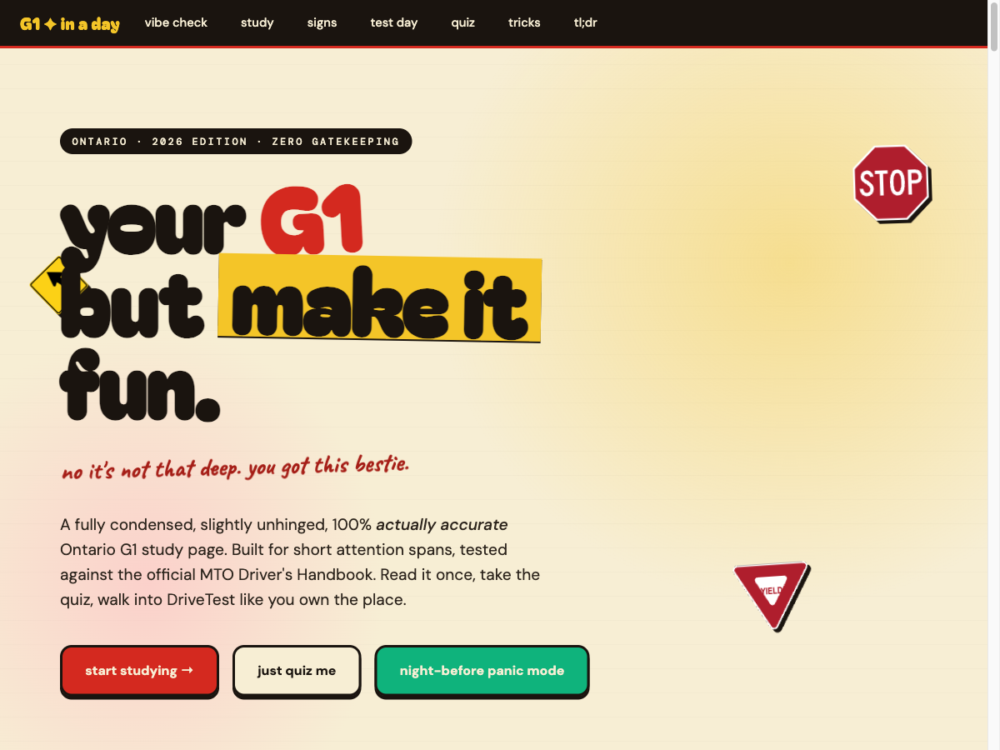
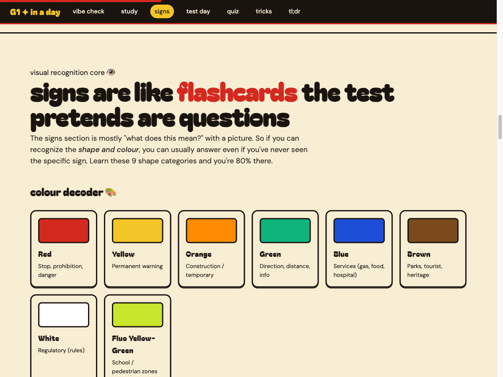
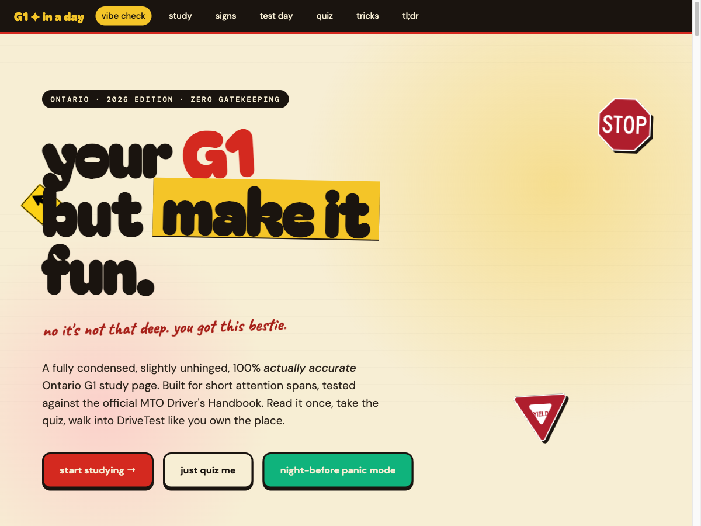

# G1 in a Day

> A condensed, slightly unhinged single-page study guide for Ontario's **G1** driver knowledge test — for short-attention-span learners who'd rather not read 80 pages of MTO Driver's Handbook the night before.

  

  
  
  
  

**Try it live → [shayanys.com/g1-fun](https://shayanys.com/g1-fun)**

---

## Why this exists

The Ontario G1 written test is 40 multiple-choice questions on rules of the road, signs, and signals. The official **MTO Driver's Handbook** is the canonical source — and it's 80+ pages of dry prose. Most prep sites are either ad-walls, paywalls, or 1990s-era HTML.

This is a single-page, ad-free, dependency-free alternative. Cream-paper neo-brutalist driver's-ed-zine vibes, chunky display fonts, inline SVG road signs, and a chatty voice that makes "yield to pedestrians in crosswalks" land. Cross-referenced against ontario.ca official sources as of May 2026.

## Features

- **Tabbed study sections** — Rules of the Road, Behind the Wheel, G1-Specific Restrictions, Penalties & Demerit Points
- **Inline SVG sign gallery** — 16+ Ontario road signs (regulatory, warning, school, construction, guide), each drawn from scratch — no image hotlinks
- **Interactive 10-question quiz** with instant feedback and scored result
- **Expandable trick-question accordion** covering the misconceptions that catch first-time test-takers (right-turn-on-red rules, four-way stop precedence, school-bus passing distances)
- **TL;DR cheat sheet** for night-before panic mode
- **Single HTML file**, no build step, no JS framework, no tracking, ~95KB on the wire

  
  

## How it was built

This wasn't hand-written from rote knowledge — it's the output of a multi-agent research pipeline:

1. **Parallel research teammates** (sonnet) surveyed the [MTO Driver's Handbook](https://www.ontario.ca/document/official-mto-drivers-handbook), [drivetest.ca](https://drivetest.ca/), and reputable prep sites — one teammate per syllabus chunk, working in isolated git worktrees. Outputs landed in [`research/`](research/).
2. **A fact-checker pass** verified every numeric claim (BAC limits, demerit thresholds, restriction hours, distance rules) against the research notes.
3. **An accessibility lead** (Opus) audited colour-contrast across all sign SVGs and tab states.
4. **A coverage lead** (Opus) cross-referenced final content against the 40-question test outline and patched gaps.

Every fact is sourced from ontario.ca official material. If you spot a regulation that's drifted out of date, please [open an issue](https://github.com/shayan-ys/ontario-g1-study-guide/issues).

## Tech

- Plain HTML, CSS, and vanilla JS — **zero external runtime dependencies**
- Inline SVG for every road sign (no images, no icon font)
- Google Fonts: Bagel Fat One, Caveat, DM Sans, DM Mono, Unbounded
- Mobile-first responsive layout
- Single file, deployable as a static asset to anything that serves HTML

## Status & disclaimer

This is a community study aid, not an official MTO product. Always verify current rules at [ontario.ca/drivers](https://www.ontario.ca/page/drivers-and-vehicles) before your test. If you find an error, open an issue or PR — corrections welcome.

## Contributing

PRs welcome, especially:

- Corrections to outdated rules / fees / demerit thresholds (cite an ontario.ca source)
- Additional trick-question entries from your own test experience
- New sign SVGs (regulatory, warning, construction — please match the existing stroke weights)

## License

[MIT](LICENSE) — fork it, remix it, ship it for your own province. A link back to [shayanys.com/g1-fun](https://shayanys.com/g1-fun) is appreciated but not required.

## Support

If this helped you pass, consider 

---

Built by <a href="https://shayanys.com">Shayan Yousefi</a> · See more projects at <a href="https://shayanys.com">shayanys.com</a>

